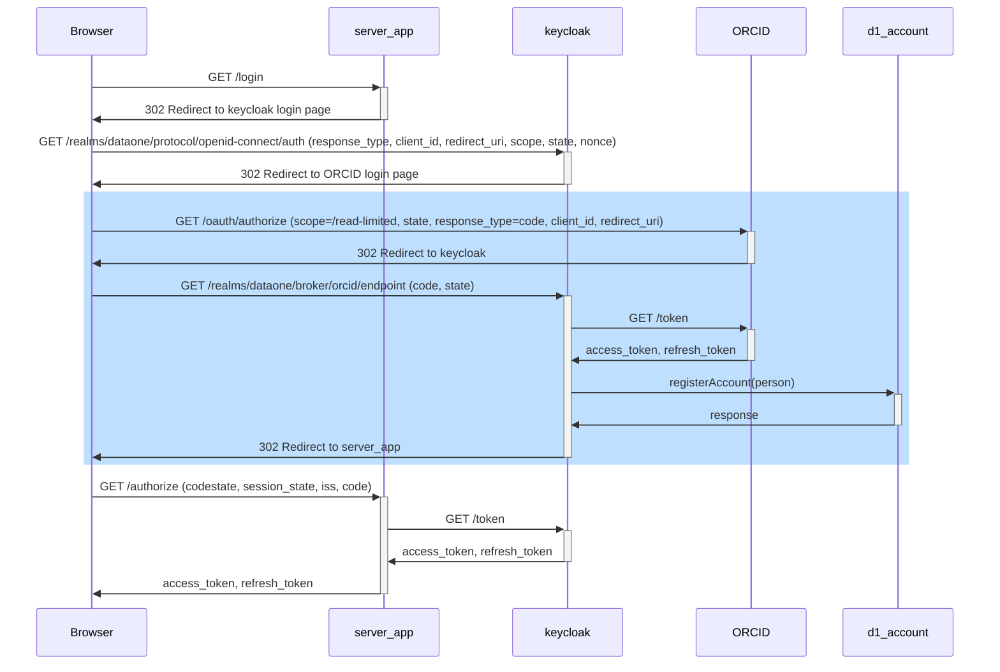
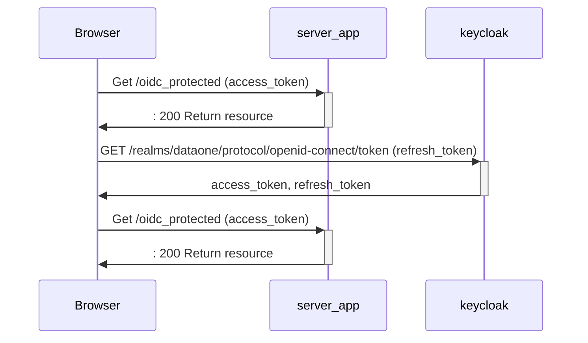
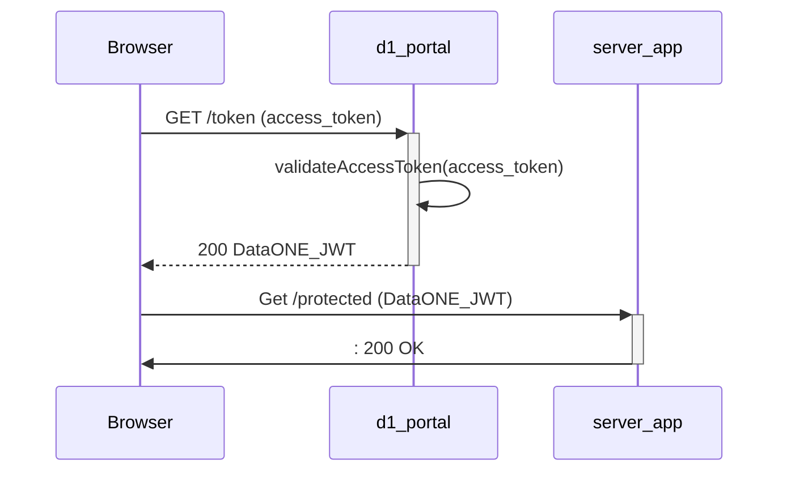

# OIDC Client Sequence Diagrams

Typical sequence diagrams for client authentication and authorization using Keycloak as an OIDC service, with ORCID configured as a 3rd-party Identity Provider.

## Authentication: Confidential clients

This sequence is for confidential clients, e.g., server applications that can securely store a client identifier and client secret and transmit those to Keycloak without exposing them to the user.

This sequence shows a browser app requesting to login at a server application, which redirects the browser first to the keycloak login page, and then to the ORCID login page when the user requests that IdP. The user then logs into ORCID, which redirects the user to the Keycloak redirect endpoint, and Keycloak retrieves the associated orcid tokens, registers the user in LDAP if needed, and then redirects the user back to the server app redirect endpoint. At this point the user sends the code to the server redirect endpoint, which collects the access_token and refresh token from Keycloak, and returns them to the browser to use in subsequent requests.

## Authorization with OIDC tokens

Once we have an OIDC token, we can send it to any DataONE service that knows how to validate OIDC tokens. If the access token is expired or is about to expire, we can use the refresh token to get a new access token.

## Exchange OAuth access token for D1Token

Once we have an OIDC token, we can use that to exchaneg it for a historical DataONE token, which can be sent to any DataONE service that does not know how to use OIDC tokens. If the DataONE token is expired, we can use a valid OIDC access_token to retrieve a new DataONE token.

## Authentication: Public clients

Authentication for public clients proceeds similarly to confidential clients, but instead of a client id and secret, the application uses a PKCE challenge to establish continuity of identity.

